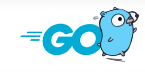

<h4 align="center"> 
    🚧  Golang🚀 Em construção... 🚧
  </h4>
   
  

    

  

  • <a href="#-sobre-o-projeto">Sobre</a> •
    <a href="#-atividades">Atividades</a> •
    <a href="#-tecnologias">Tecnologias</a> • 
    <a href="#-autor">Autor</a> • 

## 💻 Sobre o projeto

  Go é a linguagem desenvolvida pelo Google para resolver problemas da escala que a gigante da tecnologia tem e, sem dúvida, essa linguagem também vai ajudar a turbinar as suas aplicações.

Ele é uma das poucas linguagens que surgiu depois dos processadores com múltiplos núcleos e isso fez com que a linguagem tenha mecanismo de concorrência no cerne da linguagem, o que a torna ideal para aplicações na qual são exigidos um alto grau de desempenho.

Go é uma linguagem enxuta, moderna, compilada (muito rápida), que tem vários recursos que irão te ajudar nos desafios de desenvolver uma aplicação escalável!

---

## ⚙️ Atividades
  
- [x] Fundamentos da linguagem.
- [ ] Estrutura de controles, operadores, funções, ponteiros, struct, interface, polimorfismo...
- [ ] Boas práticas de programação.
- [ ] Banco de dados com Go.
- [ ] Criar Webservice básico com Go.

## 🛠 Tecnologias

As seguintes ferramentas foram usadas na construção do projeto:

- Backend: **[Golang](https://go.dev/)**

**Utilitários**

-   IDE:  **[Visual Studio Code](https://code.visualstudio.com/)**

## 🦸 Autor
---

<a href="#">
 
  

Feito por Douglas Souza 👋🏽 Entre em contato!

 

 
---

##  Versões do README

[Português 🇧🇷](./README.md) 
